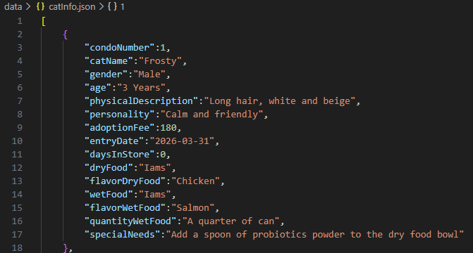
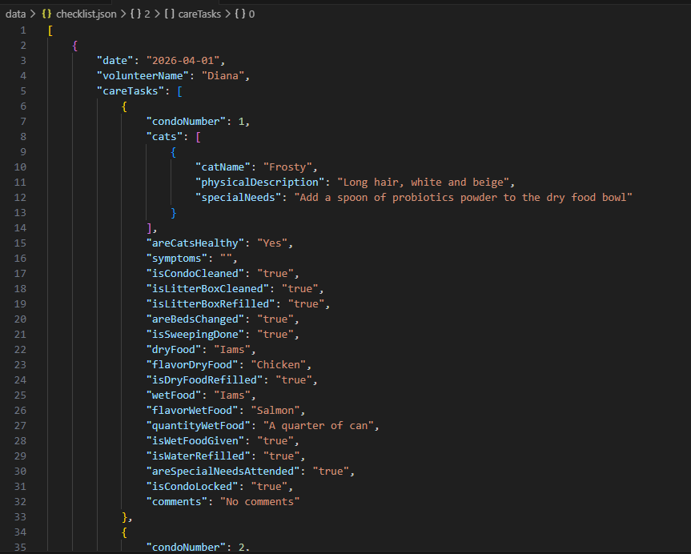

# Volunteer Catabase

Volunteer Catabase is a responsive web application to store the cat information and care details of a cat rescue and show it as a checklist for the volunteers who help take care of the cats.

The rescue staff can add, edit and delete cat information and their care details, for example the brand and flavor of the dry food and wet food or if a cat needs special attention. On the other hand, volunteers can review that information as a checklist during their shift to take care of the cats, and save, edit or delete that checklist.

# Installation Instructions

Once the project was cloned, you need to install:

- Node.js
- Dependencies: Express.js and Moment.js
- Dev Dependencies: nodemon

These are the tools and technologies used:

- HTML
- CSS (Grid, Flexbox, Media Queries)
- JavaScript
- JSON files for persisted data
- API to submit and retrieve data

# Usage

After cloning it and installing the dependencies, open the terminal and type:
```bash
npm run dev
``` 
This command starts the server, which runs in the port 8080. 

Once the server is running you can open a browser and paste the url showed in the terminal. You do not need an API key. 

You can use tools like Postman or directly through the interface to interact with the API endpoints for managing cats and checklists. 

A defaultCatInfo.json and a defaultChecklist.json are included in case you want to restore the data to its initial state.

# Examples

Data structure example: 



The cat information is very simple, an array of objects. While the checklist information is more complex with nested arrays of objects. So, manipulating and accessing the checklist information was challenging.




# Credits

Thanks to Code:You for being an option to teach programming. 

To the mentors, volunteers and general staff for their time and dedication.
